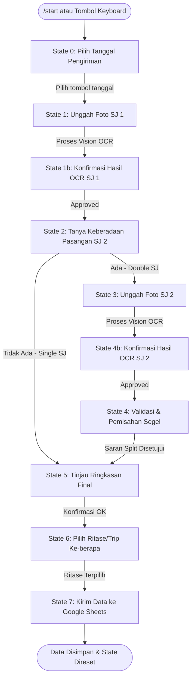

# 🚀 BotRekap MT v2.0 — Asisten Otomatisasi & OCR Surat Jalan BBM Pertamina

Sistem integrasi **Telegram Bot** bertenaga **Claude Vision API (via Maia Router)** dan **Google Sheets API** untuk melakukan otomatisasi perekaman, ekstraksi dokumen fisik Surat Jalan (SJ) BBM Pertamina, serta sinkronisasi basis data armada secara *real-time* tanpa perlu entri data manual yang melelahkan.

---

---

## ✨ Fitur & Fungsi Utama

1. **AI OCR Pemrosesan Gambar (Claude Vision API):**
   Membaca foto fisik Surat Jalan (baik foto kamera HP langsung maupun tangkapan layar Android) dan mengekstrak data JSON terstruktur yang mencakup: nomor polisi, tanggal, jam keluar, nomor LO/SO, nama pengemudi, tujuan SPBU, nama produk BBM, volume KL, hingga deretan nomor segel.
2. **Dynamic Segel Matcher & Splitter (`utils/segel_matcher.py`):**
   Untuk pengiriman ganda (2 SJ), sistem secara cerdas menggabungkan seluruh nomor segel, menghapus duplikasi, dan menyarankan pembagian segel secara rasional (misal split 2+2) untuk diisi pada baris database Google Sheets masing-masing LO.
3. **Penyimpanan Batch Google Sheets (`utils/sheet.py`):**
   Menggunakan koneksi `gspread` berkecepatan tinggi dengan skema `append_rows` batch. Data langsung dikirimkan secara serentak (1 atau 2 baris sekaligus) mulai dari **Kolom A** hingga **Kolom O** untuk menghemat kuota limit API Google.
4. **Keamanan Berlapis (Whitelist & Rate Limiting):**
   - **Whitelist Middleware:** Memblokir seluruh interaksi dari akun Telegram yang ID-nya tidak terdaftar di daftar `ALLOWED_USERS` di dalam `config.env`.
   - **Rate Limit Middleware:** Membatasi input maksimal 1 pesan per 2 detik per user untuk mencegah banjir pesan (spamming/flooding) ke bot.

---

## 📈 Kelebihan (Strengths)

* **Akurasi OCR Sangat Tinggi:** Menggunakan model **Claude Sonnet 4.6** yang sangat andal dalam mengenali dokumen kertas yang kusut, miring, atau memiliki pencahayaan buruk di lapangan.
* **Desain Skema Transaksi Aman:** Informasi rahasia seperti token Telegram, kunci API Claude, dan ID Spreadsheet disimpan di dalam berkas lokal `config.env` dan `credentials.json` yang **sepenuhnya diabaikan oleh Git (`.gitignore`)** sehingga tidak akan pernah bocor ke GitHub.
* **Efisiensi API Tinggi:** Penggunaan metode *batch append* memastikan penulisan ke Google Sheets terjadi dalam satu transaksi jaringan tunggal, meminimalkan latensi dan konsumsi rate-limit Google Drive.
* **UI Interaktif Telegram Modern:** Memanfaatkan perpaduan tombol `ReplyKeyboardMarkup` dan `InlineKeyboardMarkup` dengan status emoji yang hidup sehingga operator tidak perlu mengetik perintah teks manual.

---

## ⚠️ Kekurangan (Weaknesses)

* **Penyimpanan FSM Berbasis RAM (`MemoryStorage`):** Karena FSM disimpan di memori lokal, jika server atau skrip bot dihentikan/direstart di tengah proses pengisian Surat Jalan, sesi FSM aktif milik operator akan hilang dan mereka harus mengulangi pengisian dari awal (`/start`).
* **Fitur Koreksi Manual Bersifat Placeholder:** Tombol `"✏️ Koreksi Manual"` saat ini masih merupakan placeholder instruksional. Jika terjadi kesalahan deteksi OCR minor, operator saat ini harus mengambil ulang foto atau menerima data apa adanya (dan mengoreksinya manual langsung di Google Sheets).

---

## 🐛 Riwayat Bug & Perbaikan Terkini

Selama fase audit dan refaktorisasi terbaru, masalah-masalah kritis berikut telah **sepenuhnya diselesaikan**:
* **[RESOLVED] Kerusakan Sintaks `claude_ocr.py`:** File `utils/claude_ocr.py` yang sebelumnya tidak sengaja tertimpa oleh kode JavaScript/Google Apps Script telah direstorasi penuh kembali ke kode Python native aslinya yang diekstrak secara aman dari berkas biner `.pyc` di cache.
* **[RESOLVED] Bot Beku pada Koreksi Manual SJ2:** Sebelumnya tidak ada callback handler yang didaftarkan untuk event `ocr_koreksi:sj2` di `Input_SJ.py`, menyebabkan bot hang saat pengguna mengklik koreksi manual pada SJ kedua. Handler pencegah beku kini telah didaftarkan dengan benar.
* **[RESOLVED] Pergeseran Koordinat Kolom Google Sheets:** Karena kolom formula lama (Kolom A) dan empat kolom kosong lama (L, M, N, O) dihapus dari Spreadsheet, skema pemetaan di `utils/sheet.py` diubah untuk menulis baris sepanjang 15 kolom secara presisi dimulai dari **Kolom A (`A1`)** hingga **Kolom O**.
* **[RESOLVED] Penghapusan Folder Sampah:** Folder bernama literal `{handlers,utils,middleware}` akibat kesalahan ekspansi shell saat pembuatan direktori lama telah dibersihkan secara permanen.

---

## 🛠️ Panduan Instalasi & Penggunaan

### 1. Prasyarat
Pastikan sistem Anda telah terpasang **Python 3.12+**.

### 2. Pemasangan Dependensi
Aktifkan virtual environment Anda dan pasang dependensi yang tertera di `requirements.txt`:
```bash
source myenv/bin/activate
pip install -r requirements.txt
```

### 3. Konfigurasi Lingkungan (`config.env`)
Buat berkas bernama `config.env` di direktori utama proyek dengan isi sebagai berikut:
```env
# Token dari BotFather
BOT_TOKEN=your_telegram_bot_token_here

# Kunci API Claude (via Maia Router)
MAIA_API_KEY=your_maia_api_key_here

# Google Sheets ID dan Nama Tab sheet tujuan
SPREADSHEET_ID=your_spreadsheet_id_here
SHEET_NAME=ReportA

# Whitelist ID Telegram User (Pisahkan dengan koma jika lebih dari satu)
ALLOWED_USERS=123456789
```

### 4. Setup Google Sheets & Kredensial
Agar bot dapat menulis ke Google Sheets, Anda memerlukan **Service Account Google Cloud**:
1. Buka [Google Cloud Console](https://console.cloud.google.com/).
2. Buat Project baru, lalu aktifkan **Google Sheets API** dan **Google Drive API**.
3. Buka menu **IAM & Admin > Service Accounts** dan buat Service Account baru.
4. Buat kunci (Key) dalam format **JSON** dan unduh file tersebut.
5. Ubah nama file JSON menjadi `credentials.json` dan letakkan di dalam folder utama proyek ini.
6. Buka file JSON tersebut, salin alamat email yang ada pada kolom `client_email`.
7. Buka spreadsheet Google Sheets Anda, klik **Share (Bagikan)**, lalu tambahkan email tersebut sebagai **Editor**.

### 5. Menjalankan Bot
Untuk menyalakan server Telegram bot:
```bash
python3 main.py
```

---

## 📂 Struktur Berkas Proyek

```text
├── main.py                # Titik masuk aplikasi (entrypoint), inisialisasi middleware & router
├── koneksi.py             # Pusat manajemen koneksi gspread, dotenv, dan token telegram
├── requirements.txt       # Daftar pustaka python yang wajib dipasang
├── .gitignore             # Pengaman berkas rahasia dan sampah sistem agar tidak terunggah ke Git
├── README.md              # Dokumentasi lengkap sistem dalam Bahasa Indonesia
├── handlers/
│   ├── __init__.py        # Konstruktor modul handlers
│   ├── MenuUtama.py       # Handler perintah /start dan tampilan changelog sistem
│   ├── Input_SJ.py        # Logika State Machine utama (State 0 - 7) pengisian Surat Jalan
│   └── Laporan_OA.py      # DORMANT - Tidak aktif (dipindahkan ke GAS Web App)
├── middleware/
│   ├── __init__.py        # Konstruktor modul middleware
│   └── whitelist.py       # Keamanan: Whitelist user telegram & rate limiter (anti-flood)
└── utils/
    ├── __init__.py        # Konstruktor modul utilities
    ├── claude_ocr.py      # Integrasi Maia Router Claude Vision API untuk ekstraksi foto
    ├── segel_matcher.py   # Algoritma validasi, deduplikasi, dan saran pemisahan (split) segel
    └── sheet.py           # Eksekusi batch append data baris ke tabel Google Sheets
```
## 📐 Arsitektur & Alur Kerja FSM (Finite State Machine)

Bot ini dikembangkan dengan arsitektur **State Machine** berbasis **Aiogram v3** untuk memastikan alur kerja operator di lapangan terekam dengan presisi:



